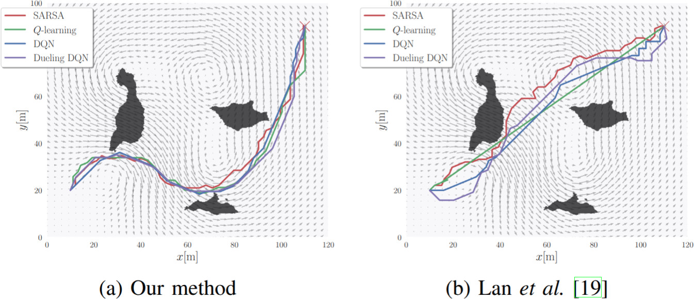

# Energy-efficient Navigation in Unknown Static Flow Fields using Reinforcement Learning
Authors:
* Armando Alves Neto¹
* Victor C. da S. Campos¹
* Douglas G. Macharet²

Affiliation:\
¹Department of Electronics Engineering\
²Computer Vision and Robotics Laboratory (VeRLab), Department of Computer Science\
Universidade Federal de Minas Gerais, Brazil

##
Implementation for the Energy-efficient Navigation in Unknown Static Flow Fields using Reinforcement Learning

<p align="center">
  
</p>

This repository implements **Reinforcement Learning algorithms** for 2D
navigation in a flow field environment with obstacles.

The environment simulates an agent navigating toward a goal while
minimizing exposure to a dynamic flow field and avoiding collisions
defined by a binary map image.

The project includes:
- **Tabular TD methods**: Sarsa and Q-learning\
- **Deep RL methods**: DQN and Dueling DQN

##
# Main Scripts

-   `Flow_td.py` → Sarsa and Q-learning (tabular methods)\
-   `Flow_dqn.py` → DQN and Dueling DQN (deep neural networks)

##
## Installing

## Clone the repository

``` bash
git clone https://github.com/your-username/your-repo.git
cd your-repo
```

## Create a virtual environment (recommended)

``` bash
python -m venv venv
source venv/bin/activate   # Linux/Mac
# or
venv\Scripts\activate      # Windows
```

## Install dependencies

``` bash
pip install -r requirements.txt
```

### Linux users

The code uses the `TkAgg` backend for Matplotlib. You may need:

``` bash
sudo apt-get install python3-tk
```

##
# Environment Description

The environment:
- Is 2D continuous (or discretized for tabular methods)
- Uses a grayscale image to define obstacles
- Includes multiple vortex-like flow sources
- Computes exposure cost based on flow intensity
- Allows multiple agents to train in parallel

##
# Running Tabular Methods (Sarsa / Q-learning)

``` bash
python Flow_td.py
```

Example:

``` bash
python Flow_td.py --method Qlearning --episodes 10000 --eps 0.05 --save_Q
```

## Flow_td Parameters

  Parameter        Description                   Default
  ---------------- ----------------------------- ------------------
  `--episodes`     Number of training episodes   20000
  `--gamma`        Discount factor               0.99
  `--eps`          Epsilon for ε-greedy policy   0.1
  `--alpha`        Learning rate                 0.5
  `--method`       `Sarsa` or `Qlearning`        Sarsa
  `--save_Q`       Save Q-table                  False
  `--load_Q`       Load Q-table                  False
  `--q_file`       Base filename for Q-table     qtable
  `--map`          Path to map image             imgs/islands.png
  `--xgoal`        Goal position (x y)           110 90
  `--xlim`         Environment x limits          0 120
  `--ylim`         Environment y limits          0 100
  `--nagents`      Number of parallel agents     2
  `--resolution`   Flow field resolution         500

##
# Running Deep RL (DQN / Dueling DQN)

``` bash
python Flow_dqn.py
```

Example:

``` bash
python Flow_dqn.py --type DuDQN --episodes 5000 --save_Q
```

## Flow_dqn Parameters

  Parameter         Description                          Default
  ----------------- ------------------------------------ ------------------
  `--episodes`      Number of training episodes          1000
  `--gamma`         Discount factor                      0.99
  `--eps`           Epsilon for ε-greedy policy          0.1
  `--alpha`         Learning rate (Adam)                 1e-3
  `--batch_size`    Replay buffer batch size             64
  `--update_rate`   Target update frequency (episodes)   5
  `--tau`           Soft update factor                   1e-3
  `--type`          `DQN` or `DuDQN`                     DQN
  `--save_Q`        Save trained model                   False
  `--load_Q`        Load trained model                   False
  `--q_file`        Base filename for model              qnet
  `--map`           Path to map image                    imgs/islands.png
  `--xgoal`         Goal position (x y)                  110 90
  `--xlim`          Environment x limits                 0 120
  `--ylim`          Environment y limits                 0 100
  `--nagents`       Number of parallel agents            2
  `--resolution`    Flow field resolution                500

##
# Output

During training, the program displays:
- Agent trajectory
- Flow vector field
- Obstacle map
- Reward curve (mean ± 2σ across agents)

Generated folders:
- `models/` → Saved Q-tables or neural network models\
- `fields/` → Cached flow field data

##
# Project Structure
    ├── Flow_td.py
    ├── Flow_dqn.py
    ├── class_env.py
    ├── class_flow.py
    ├── class_flow_field.py
    ├── class_map.py
    ├── imgs/
    │   └── islands.png
    ├── models/
    ├── fields/
    └── requirements.txt
